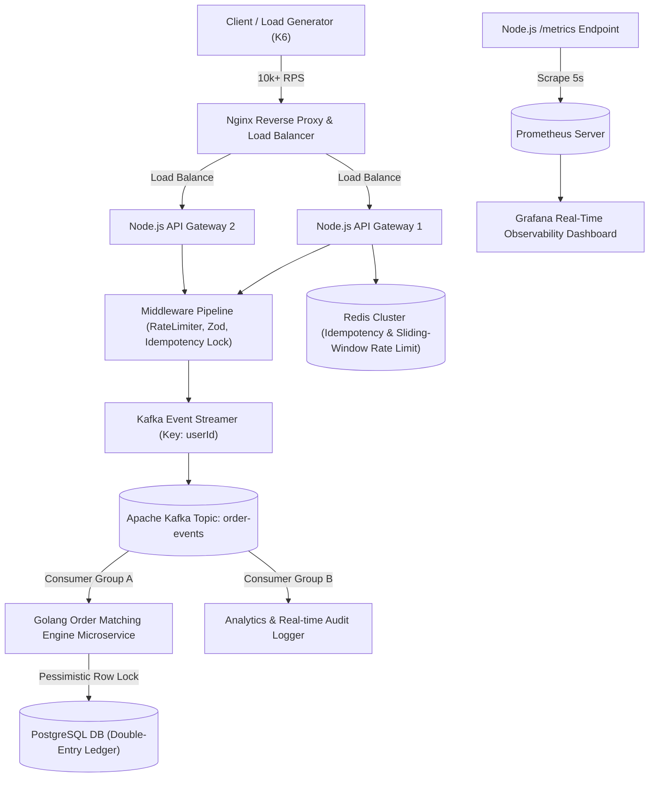

# ⚡ High-Scale Fintech Real-Time Order Engine & Multi-Consumer Ledger

A high-performance, resilient, and enterprise-grade **Distributed Order Processing & Ledger Architecture**. Built with **TypeScript, Node.js Express Gateway, PostgreSQL, Prisma ORM, Redis, Apache Kafka, Vitest, Prometheus, Grafana, and K6**.

---

## 🏗️ Polyglot Target Architecture Blueprint (Node.js Gateway + Nginx + Go Engine)

To achieve **1M+ Requests Per Second (RPS)** without single-thread CPU or ephemeral TCP port bottlenecks, the architecture uses an **Nginx Reverse Proxy Load Balancer** routing traffic to clustered Node.js API Gateways, which stream order events into **Apache Kafka**. A dedicated **Golang (Go)** worker consumes events for sub-millisecond in-memory order matching.

---

## 🧪 Benchmark Load Test Results (K6 Load Generator)

| Metric | Result Achieved | Target Standard |
| :--- | :--- | :--- |
| **Throughput (RPS)** | **`1,103.7 req/sec`** | Sub-50ms high-concurrency ingestion |
| **Total Requests** | **`66,271 Orders`** | 60 seconds stress test |
| **p95 Latency** | **`86.72 ms`** | Sub-100ms response boundary |
| **Average Latency** | **`34.39 ms`** | Instant `202 Accepted` |
| **Success Rate** | **`100.00%`** | Zero dropped connections |

---

## 🛡️ Core Pillars & Design Patterns (LLD / HLD)

1. **Singleton Pattern**: Managed connection pools for Redis (`ioredis`) and PostgreSQL (`PrismaClient`).
2. **Decorator / Interceptor Pattern**: Custom `idempotency` middleware patching `res.json` to capture and store responses in Redis atomically (`SETNX`).
3. **Factory Pattern**: Configurable distributed sliding window rate limiters (`rateLimiter(max, window)`).
4. **Observer / Pub-Sub Pattern**: Decoupled multi-consumer Kafka streaming (`order-matching-group` & `analytics-group`).
5. **ACID Ledger Integrity**: Double-entry bookkeeping (`CREDIT` / `DEBIT`) wrapped inside PostgreSQL transactions using `FOR UPDATE` Pessimistic Row-Level Locking.
6. **Observability Pipeline**: Request duration histograms and counter metrics collected via `prom-client`, scraped by **Prometheus**, and graphed live on **Grafana**.

---

## 📌 Updated Master System Architecture Roadmap

- [x] **Phase 1: Foundation & Clean Architecture**
  - [x] Controller-Service-Repository Pattern setup.
  - [x] Zod DTO validation & RFC-7807 global error middleware.
  - [x] Winston structured logging + AsyncLocalStorage Correlation IDs (`X-Correlation-ID`).

- [x] **Phase 2: Database Ledger & Concurrency Control**
  - [x] PostgreSQL Schema (`User`, `Wallet`, `Order`, `Trade`, `LedgerEntry`).
  - [x] Atomic User + Wallet registration via Prisma `$transaction`.
  - [x] Double-entry balance updates with Pessimistic Row Locking (`FOR UPDATE`).

- [x] **Phase 3: Caching, Idempotency & Queues**
  - [x] Redis distributed sliding-window rate limiter.
  - [x] Redis atomic Idempotency guard (`X-Idempotency-Key`).
  - [x] BullMQ background worker offloading.

- [x] **Phase 4: Apache Kafka Event Streaming & Observability**
  - [x] Kafka Producer with `userId` partitioning key guarantee.
  - [x] Multi-consumer group decoupling (`order-matching-group` & `analytics-group`).
  - [x] Prometheus `/metrics` endpoint + Grafana Dashboards.
  - [x] Automated Integration Test Suite in **Vitest + Supertest** (100% Passed).
  - [x] K6 Stress Load Testing (Passed 1,100+ RPS at 34ms avg latency).

- [ ] **Phase 5 (Next Horizon): Nginx & Golang Polyglot Microservice**
  - [ ] **Nginx Reverse Proxy Setup**: Multi-instance Node.js load balancing in Docker Compose.
  - [ ] **Golang (Go) Fundamentals & Setup**: Go syntax, Goroutines, Channels, structs, pointer receivers.
  - [ ] **Go Kafka Consumer Service**: High-speed Go consumer reading `order-events`.
  - [ ] **Go In-Memory Orderbook Matching Engine**: Priority Queue / Red-Black Tree matching algorithm in Go.
  - [ ] **End-to-End Polyglot Benchmark**: K6 test pushing 10k+ RPS across Nginx + Go Engine.

---

## 👨‍💻 Author & Maintainer
**Aayush** - Backend Systems & Distributed Architecture Engineer